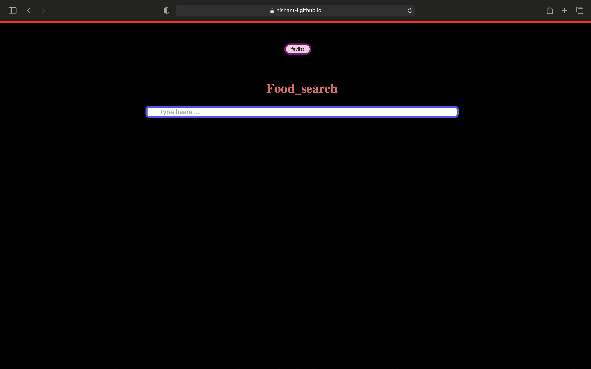

<h1>Meals WebApp</h1>

[Visit the webApp](https://nishant-l.github.io/Food_Info_fiender/)

<h3>Preview</h3>

<h3>Descreption</h3>

A web app to search meals. The search reasult includs meal information and an image. You can add meals to your feverates list and the list is maintened after refreshing the web page

